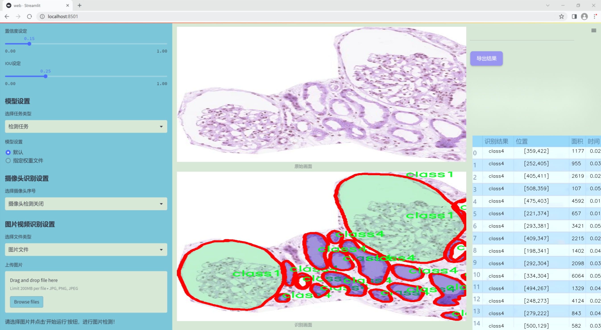
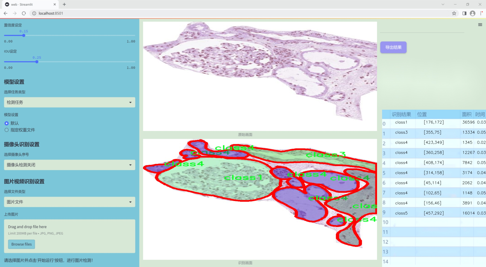
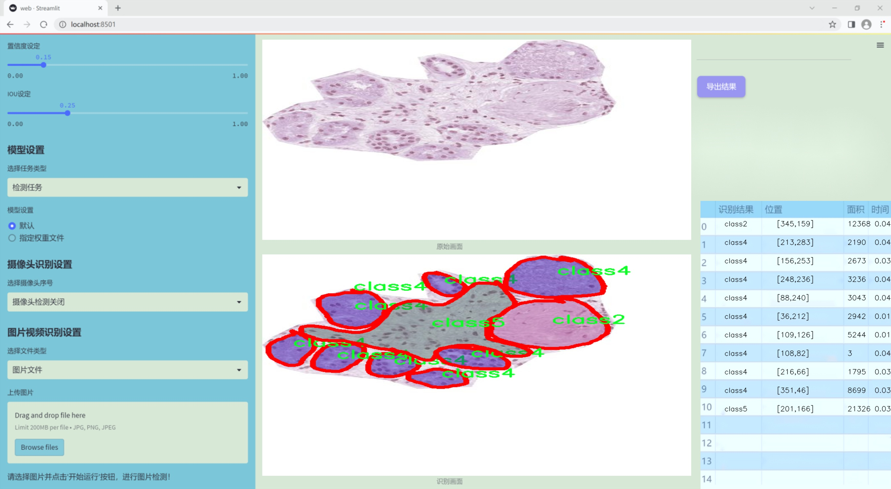
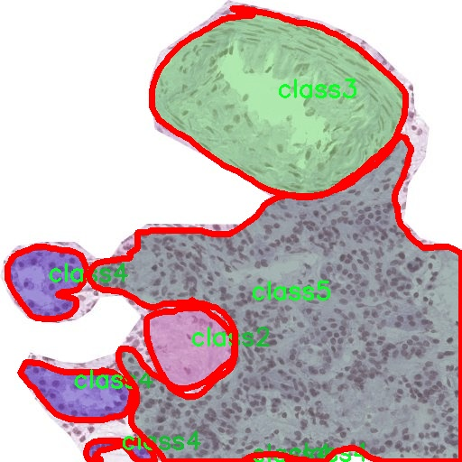
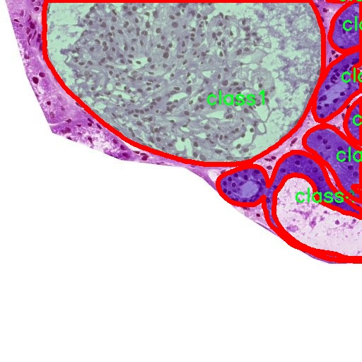
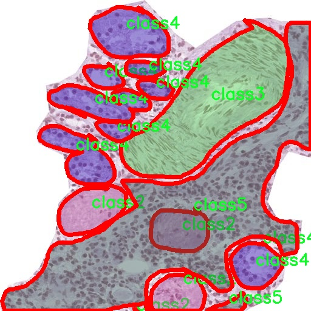
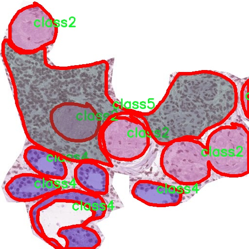
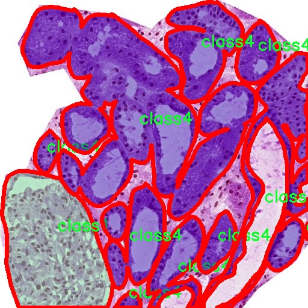

### 1.背景意义

### 研究背景与意义

肾脏病变的早期诊断与精确分割在医学影像学中具有重要的临床意义。随着影像技术的进步，尤其是计算机视觉和深度学习的快速发展，利用先进的算法对肾脏病变进行自动化检测和分割已成为研究的热点。传统的影像分析方法往往依赖于人工标注和经验判断，存在主观性强、效率低下等问题。因此，基于深度学习的实例分割技术应运而生，能够有效提高肾脏病变的检测精度和效率。

本研究旨在构建一个基于改进YOLOv11的肾脏病变实例分割系统。YOLO（You Only Look Once）系列模型因其高效的实时检测能力而广泛应用于各类计算机视觉任务。通过对YOLOv11的改进，我们期望能够在保持高效性的同时，进一步提升对肾脏病变的分割精度。该系统将利用一个包含1100幅图像的多类别数据集，涵盖五种不同类型的肾脏病变。这些图像经过精细标注，能够为模型的训练提供丰富的样本支持。

在医学影像分析领域，实例分割不仅有助于识别病变区域的形状和大小，还能为后续的定量分析提供基础数据。这对于制定个性化的治疗方案、评估治疗效果以及进行疾病预后分析具有重要的临床价值。此外，随着数据集的不断扩展和模型的持续优化，基于深度学习的肾脏病变分割系统将有望在未来的临床实践中发挥更大的作用，为肾脏疾病的早期筛查和干预提供有力支持。通过本研究，我们希望能够推动肾脏病变自动化检测技术的发展，提升医疗服务的质量与效率。

### 2.视频效果

[2.1 视频效果](https://www.bilibili.com/video/BV1SikEYJEZA/)

### 3.图片效果







##### [项目涉及的源码数据来源链接](https://kdocs.cn/l/cszuIiCKVNis)**

注意：本项目提供训练的数据集和训练教程,由于版本持续更新,暂不提供权重文件（best.pt）,请按照6.训练教程进行训练后实现上图演示的效果。

### 4.数据集信息

##### 4.1 本项目数据集类别数＆类别名

nc: 5
names: ['class1', 'class2', 'class3', 'class4', 'class5']


该项目为【图像分割】数据集，请在【训练教程和Web端加载模型教程（第三步）】这一步的时候按照【图像分割】部分的教程来训练

##### 4.2 本项目数据集信息介绍

本项目数据集信息介绍

本项目所使用的数据集名为“kidny_fold3”，旨在为改进YOLOv11的肾脏病变实例分割系统提供强有力的支持。该数据集专注于肾脏病变的检测与分析，涵盖了多种类型的病变，能够有效提升模型在肾脏疾病诊断中的准确性和鲁棒性。数据集中包含五个主要类别，分别为“class1”、“class2”、“class3”、“class4”和“class5”，这些类别代表了不同类型的肾脏病变特征。

在数据集的构建过程中，特别注重样本的多样性和代表性，以确保模型能够适应不同患者的病理特征。每个类别的样本均经过精心标注，确保标注的准确性和一致性。这种细致的标注工作为后续的模型训练提供了坚实的基础，使得YOLOv11能够在实例分割任务中实现更高的精度。

此外，数据集的规模和质量也经过严格把控，包含了大量的图像数据，这些图像不仅涵盖了不同的肾脏病变类型，还考虑了不同的成像条件和角度。这种多样化的图像数据使得模型在训练过程中能够学习到更丰富的特征，从而在实际应用中更好地应对各种复杂情况。

通过使用“kidny_fold3”数据集，本项目旨在推动肾脏病变检测技术的发展，提高临床诊断的效率和准确性，为肾脏疾病患者提供更为精准的医疗服务。数据集的设计与应用不仅为YOLOv11的改进提供了有力支持，也为未来相关研究奠定了基础。











### 5.全套项目环境部署视频教程（零基础手把手教学）

[5.1 所需软件PyCharm和Anaconda安装教程（第一步）](https://www.bilibili.com/video/BV1BoC1YCEKi/?spm_id_from=333.999.0.0&vd_source=bc9aec86d164b67a7004b996143742dc)


[5.2 安装Python虚拟环境创建和依赖库安装视频教程（第二步）](https://www.bilibili.com/video/BV1ZoC1YCEBw?spm_id_from=333.788.videopod.sections&vd_source=bc9aec86d164b67a7004b996143742dc)

### 6.改进YOLOv11训练教程和Web_UI前端加载模型教程（零基础手把手教学）

[6.1 改进YOLOv11训练教程和Web_UI前端加载模型教程（第三步）](https://www.bilibili.com/video/BV1BoC1YCEhR?spm_id_from=333.788.videopod.sections&vd_source=bc9aec86d164b67a7004b996143742dc)


按照上面的训练视频教程链接加载项目提供的数据集，运行train.py即可开始训练



     Epoch   gpu_mem       box       obj       cls    labels  img_size
     1/200     20.8G   0.01576   0.01955  0.007536        22      1280: 100%|██████████| 849/849 [14:42<00:00,  1.04s/it]
               Class     Images     Labels          P          R     mAP@.5 mAP@.5:.95: 100%|██████████| 213/213 [01:14<00:00,  2.87it/s]
                 all       3395      17314      0.994      0.957      0.0957      0.0843

     Epoch   gpu_mem       box       obj       cls    labels  img_size
     2/200     20.8G   0.01578   0.01923  0.007006        22      1280: 100%|██████████| 849/849 [14:44<00:00,  1.04s/it]
               Class     Images     Labels          P          R     mAP@.5 mAP@.5:.95: 100%|██████████| 213/213 [01:12<00:00,  2.95it/s]
                 all       3395      17314      0.996      0.956      0.0957      0.0845

     Epoch   gpu_mem       box       obj       cls    labels  img_size
     3/200     20.8G   0.01561    0.0191  0.006895        27      1280: 100%|██████████| 849/849 [10:56<00:00,  1.29it/s]
               Class     Images     Labels          P          R     mAP@.5 mAP@.5:.95: 100%|███████   | 187/213 [00:52<00:00,  4.04it/s]
                 all       3395      17314      0.996      0.957      0.0957      0.0845


###### [项目数据集下载链接](https://kdocs.cn/l/cszuIiCKVNis)

### 7.原始YOLOv11算法讲解

YOLO11采用改进的骨干和颈部架构，增强了特征提取能力，提高了物体检测的精确度和复杂任务的表现。YOLO11引入精炼的架构设计和优化的训练流程，实现更快的处理速度，同时保持精度和性能之间的最佳平衡。通过模型设计的进步，YOLO11m在COCO数据集上实现了更高的均值平均精度（mAP），同时使用比YOLOv8m少22%的参数，使其在不妥协准确性的情况下更加计算高效。YOLO11可以无缝部署在各种环境中，包括边缘设备、云平台以及支持NVIDIA
GPU的系统，确保最大灵活性。无论是物体检测、实例分割、图像分类、姿态估计，还是定向物体检测（OBB），YOLO11都旨在应对多样的计算机视觉挑战。


##### **Ultralytics YOLO11相比于之前版本的主要改进有哪些？**

Ultralytics YOLO11在其前身基础上引入了几项重要进步。主要改进包括：

  1. **增强的特征提取** ：YOLO11采用改进的骨干和颈部架构，增强了特征提取能力，提高了物体检测的精确度。
  2.  **优化的效率和速度** ：精炼的架构设计和优化的训练流程实现了更快的处理速度，同时保持了准确性和性能之间的平衡。
  3.  **更高的准确性与更少的参数** ：YOLO11m在COCO数据集上实现了更高的均值平均精度（mAP），同时使用比YOLOv8m少22%的参数，使其在不妥协准确性的情况下更加计算高效。
  4.  **环境适应性强** ：YOLO11可以在多种环境中部署，包括边缘设备、云平台以及支持NVIDIA GPU的系统。
  5.  **支持广泛的任务** ：YOLO11支持多种计算机视觉任务，如物体检测、实例分割、图像分类、姿态估计和定向物体检测（OBB）。

我们先来看一下其网络结构有什么变化，可以看出，相比较于YOLOv8模型，其将CF2模块改成C3K2，同时在SPPF模块后面添加了一个C2PSA模块，且将YOLOv10的head思想引入到YOLO11的head中，使用深度可分离的方法，减少冗余计算，提高效率。下面我们来详细看一下这两个模块的结构是怎么构成的，以及它们为什么要这样设计


##### C3K2的网络结构

从下面图中我们可以看到，C3K2模块其实就是C2F模块转变出来的，它代码中有一个设置，就是当c3k这个参数为FALSE的时候，C3K2模块就是C2F模块，也就是说它的Bottleneck是普通的Bottleneck；反之当它为true的时候，将Bottleneck模块替换成C3模块。


##### C2PSA的网络结构

` `C2PSA是对 `C2f` 模块的扩展，它结合了PSA(Pointwise Spatial
Attention)块，用于增强特征提取和注意力机制。通过在标准 `C2f` 模块中引入 PSA
块，C2PSA实现了更强大的注意力机制，从而提高了模型对重要特征的捕捉能力。


##### **C2f 模块回顾：**

**** C2f模块是一个更快的 CSP（Cross Stage Partial）瓶颈实现，它通过两个卷积层和多个 Bottleneck
块进行特征提取。相比传统的 CSPNet，C2f 优化了瓶颈层的结构，使得计算速度更快。在 C2f中，`cv1` 是第一个 1x1
卷积，用于减少通道数；`cv2` 是另一个 1x1 卷积，用于恢复输出通道数。而 `n` 是一个包含 Bottleneck 块的数量，用于提取特征。

##### **C2PSA 模块的增强** ：

**C2PSA** 扩展了 C2f，通过引入PSA( **Position-Sensitive Attention)**
，旨在通过多头注意力机制和前馈神经网络来增强特征提取能力。它可以选择性地添加残差结构（shortcut）以优化梯度传播和网络训练效果。同时，使用FFN
可以将输入特征映射到更高维的空间，捕获输入特征的复杂非线性关系，允许模型学习更丰富的特征表示。

##### head部分

YOLO11在head部分的cls分支上使用深度可分离卷积 ，具体代码如下，cv2边界框回归分支，cv3分类分支。

    
    
     self.cv2 = nn.ModuleList(
                nn.Sequential(Conv(x, c2, 3), Conv(c2, c2, 3), nn.Conv2d(c2, 4 * self.reg_max, 1)) for x in ch
            )
            self.cv3 = nn.ModuleList(
                nn.Sequential(
                    nn.Sequential(DWConv(x, x, 3), Conv(x, c3, 1)),
                    nn.Sequential(DWConv(c3, c3, 3), Conv(c3, c3, 1)),
                    nn.Conv2d(c3, self.nc, 1),
                )
                for x in ch
            )


### 8.200+种全套改进YOLOV11创新点原理讲解

#### 8.1 200+种全套改进YOLOV11创新点原理讲解大全

由于篇幅限制，每个创新点的具体原理讲解就不全部展开，具体见下列网址中的改进模块对应项目的技术原理博客网址【Blog】（创新点均为模块化搭建，原理适配YOLOv5~YOLOv11等各种版本）

[改进模块技术原理博客【Blog】网址链接](https://gitee.com/qunmasj/good)


#### 8.2 精选部分改进YOLOV11创新点原理讲解

###### 这里节选部分改进创新点展开原理讲解(完整的改进原理见上图和[改进模块技术原理博客链接](https://gitee.com/qunmasj/good)【如果此小节的图加载失败可以通过CSDN或者Github搜索该博客的标题访问原始博客，原始博客图片显示正常】


### FocalModulation模型的基本原理
参考该博客，Focal Modulation Networks（FocalNets）的基本原理是替换自注意力（Self-Attention）模块，使用焦点调制（focal modulation）机制来捕捉图像中的长距离依赖和上下文信息。下图是自注意力和焦点调制两种方法的对比。


自注意力要求对每个查询令牌（Query Token）与其他令牌进行复杂的查询-键（Query-Key）交互和查询-值（Query-Value）聚合，以计算注意力分数并捕捉上下文。而焦点调制则先将空间上下文以不同粒度聚合到调制器中，然后以查询依赖的方式将这些调制器注入到查询令牌中。焦点调制简化了交互和聚合操作，使其更轻量级。在图中，自注意力部分使用红色虚线表示查询-键交互和黄色虚线表示查询-值聚合，而焦点调制部分则用蓝色表示调制器聚合和黄色表示查询-调制器交互。 

FocalModulation模型通过以下步骤实现：

1. 焦点上下文化：用深度卷积层堆叠来编码不同范围的视觉上下文。


2. 门控聚合：通过门控机制，选择性地将上下文信息聚合到每个查询令牌的调制器中。


3. 逐元素仿射变换：将聚合后的调制器通过仿射变换注入到每个查询令牌中。

下面来分别介绍这三个机制->

#### 焦点上下文化
焦点上下文化（Focal Contextualization）是焦点调制（Focal Modulation）的一个组成部分。焦点上下文化使用一系列深度卷积层（depth-wise convolutional layers）来编码不同范围内的视觉上下文信息。这些层可以捕捉从近处到远处的视觉特征，从而允许网络在不同层次上理解图像内容。通过这种方式，网络能够在聚合上下文信息时保持对局部细节的敏感性，并增强对全局结构的认识。


​

这张图详细比较了自注意力（Self-Attention, SA）和焦点调制（Focal Modulation）的机制，并特别展示了焦点调制中的上下文聚合过程。左侧的图展示了自注意力模型如何通过键（k）和查询（q）之间的交互，以及随后的聚合来生成输出。而中间和右侧的图说明了焦点调制如何通过层级化的上下文聚合和门控聚合过程替代自注意力模型的这一过程。在焦点调制中，输入首先通过轻量级线性层进行处理，然后通过层级化的上下文化模块和门控机制来选择性地聚合信息，最终通过调制器与查询（q）进行交互以生成输出。

#### 门控聚合
在Focal Modulation Networks（FocalNets）中的 "门控聚合"（Gated Aggregation）是关键组件之一，这一过程涉及使用门控机制来选择性地聚合上下文信息。以下是这个过程的详细分析：

1. 什么是门控机制？
门控机制在深度学习中常用于控制信息流。它通常用于决定哪些信息应该被传递，哪些应该被阻断。在循环神经网络（RNN）中，特别是在长短期记忆网络（LSTM）和门控循环单元（GRU）中，门控机制用于调节信息在时间序列数据中的流动。

2. 门控聚合的目的
在FocalNets中，门控聚合的目的是为每个查询令牌（即处理中的数据单元）选择性地聚合上下文信息。这意味着网络能够决定哪些特定的上下文信息对于当前处理的查询令牌是重要的，从而专注于那些最相关的信息。

3. 如何实现门控聚合？
实现门控聚合可能涉及一系列计算步骤，其中包括：

计算上下文信息：这可能涉及使用深度卷积层（如文中提到的）对输入图像的不同区域进行编码，以捕捉从局部到全局的视觉上下文。
门控操作：这一步骤涉及到一个决策过程，根据当前查询令牌的特征来决定哪些上下文信息是相关的。这可能通过一个学习到的权重（门）来实现，该权重决定了不同上下文信息的重要性。
信息聚合：最后，根据门控操作的结果，选择性地聚合上下文信息到一个调制器中。这个调制器随后被用于调整或“调制”查询令牌的表示。
4. 门控聚合的好处
通过门控聚合，FocalNets能够更有效地聚焦于对当前任务最关键的信息。这种方法提高了模型的效率和性能，因为它减少了不必要信息的处理，同时增强了对关键特征的关注。在视觉任务中，这可能意味着更好的目标检测和图像分类性能，特别是在复杂或多变的视觉环境中。

总结：门控聚合是FocalNets的一个核心组成部分，它通过选择性地集中处理重要的上下文信息来提升网络的效率和性能。

#### 逐元素仿射变换
在Focal Modulation Networks（FocalNets）中的第三个关键组件是逐元素仿射变换，这个步骤涉及将通过门控聚合得到的调制器注入到每个查询令牌中。以下是该过程的详细分析：

1. 仿射变换的基本概念：
仿射变换是一种线性变换，用于对数据进行缩放、旋转、平移和倾斜等操作。在深度学习中，逐元素的仿射变换通常指的是对每个元素进行线性变换，这种变换可以被描述为y = ax + b，其中x是输入，y是输出，a和b是变换的参数。

2. 逐元素仿射变换的作用：
在FocalNets中，逐元素仿射变换的作用是将聚合后的调制器信息注入到每个查询令牌中。这个步骤对于整合上下文信息和查询令牌的原始特征非常重要。通过这种方式，调制器所包含的上下文信息可以直接影响查询令牌的表示。

3. 执行仿射变换：
执行这一步骤时，聚合后的调制器对每个查询令牌进行逐元素的仿射变换。在实践中，这可能意味着对查询令牌的每个特征应用调制器中的相应权重（a）和偏差（b）。这样，调制器中的每个元素都直接对应于查询令牌的一个特征，通过调整这些特征来改变其表达。

4. 仿射变换的效果：
通过逐元素仿射变换，模型能够更细致地调整每个查询令牌的特征，根据上下文信息来增强或抑制某些特征。这种精细的调整机制允许网络更好地适应复杂的视觉场景，提高对细节的捕捉能力，从而提升了模型在各种视觉任务中的性能，如目标检测和图像分类。

总结：逐元素仿射变换它使得模型能够利用上下文信息来有效地调整查询令牌，增强了模型对关键视觉特征的捕捉和表达能力。


### 9.系统功能展示

图9.1.系统支持检测结果表格显示

  图9.2.系统支持置信度和IOU阈值手动调节

  图9.3.系统支持自定义加载权重文件best.pt(需要你通过步骤5中训练获得)

  图9.4.系统支持摄像头实时识别

  图9.5.系统支持图片识别

  图9.6.系统支持视频识别

  图9.7.系统支持识别结果文件自动保存

  图9.8.系统支持Excel导出检测结果数据


### 10. YOLOv11核心改进源码讲解

#### 10.1 starnet.py

以下是对给定代码的核心部分进行提炼和详细注释的结果：

```python
import torch
import torch.nn as nn
from timm.models.layers import DropPath, trunc_normal_

class ConvBN(torch.nn.Sequential):
    """
    定义一个卷积层后接批归一化层的组合。
    """
    def __init__(self, in_planes, out_planes, kernel_size=1, stride=1, padding=0, dilation=1, groups=1, with_bn=True):
        super().__init__()
        # 添加卷积层
        self.add_module('conv', torch.nn.Conv2d(in_planes, out_planes, kernel_size, stride, padding, dilation, groups))
        # 如果需要，添加批归一化层
        if with_bn:
            self.add_module('bn', torch.nn.BatchNorm2d(out_planes))
            # 初始化批归一化层的权重和偏置
            torch.nn.init.constant_(self.bn.weight, 1)
            torch.nn.init.constant_(self.bn.bias, 0)

class Block(nn.Module):
    """
    StarNet中的基本构建块，包含深度卷积和元素级乘法。
    """
    def __init__(self, dim, mlp_ratio=3, drop_path=0.):
        super().__init__()
        # 深度卷积层
        self.dwconv = ConvBN(dim, dim, 7, 1, (7 - 1) // 2, groups=dim, with_bn=True)
        # 线性变换层
        self.f1 = ConvBN(dim, mlp_ratio * dim, 1, with_bn=False)
        self.f2 = ConvBN(dim, mlp_ratio * dim, 1, with_bn=False)
        self.g = ConvBN(mlp_ratio * dim, dim, 1, with_bn=True)
        self.dwconv2 = ConvBN(dim, dim, 7, 1, (7 - 1) // 2, groups=dim, with_bn=False)
        self.act = nn.ReLU6()  # 使用ReLU6激活函数
        self.drop_path = DropPath(drop_path) if drop_path > 0. else nn.Identity()  # 随机深度

    def forward(self, x):
        input = x  # 保存输入以便后续残差连接
        x = self.dwconv(x)  # 深度卷积
        x1, x2 = self.f1(x), self.f2(x)  # 线性变换
        x = self.act(x1) * x2  # 元素级乘法
        x = self.dwconv2(self.g(x))  # 通过g层和第二个深度卷积
        x = input + self.drop_path(x)  # 残差连接
        return x

class StarNet(nn.Module):
    """
    StarNet网络结构，包含多个阶段和基本块。
    """
    def __init__(self, base_dim=32, depths=[3, 3, 12, 5], mlp_ratio=4, drop_path_rate=0.0, num_classes=1000, **kwargs):
        super().__init__()
        self.num_classes = num_classes
        self.in_channel = 32
        # stem层，输入图像经过卷积和激活
        self.stem = nn.Sequential(ConvBN(3, self.in_channel, kernel_size=3, stride=2, padding=1), nn.ReLU6())
        dpr = [x.item() for x in torch.linspace(0, drop_path_rate, sum(depths))]  # 随机深度
        self.stages = nn.ModuleList()  # 存储各个阶段
        cur = 0
        for i_layer in range(len(depths)):
            embed_dim = base_dim * 2 ** i_layer  # 当前阶段的嵌入维度
            down_sampler = ConvBN(self.in_channel, embed_dim, 3, 2, 1)  # 下采样层
            self.in_channel = embed_dim
            blocks = [Block(self.in_channel, mlp_ratio, dpr[cur + i]) for i in range(depths[i_layer])]  # 当前阶段的块
            cur += depths[i_layer]
            self.stages.append(nn.Sequential(down_sampler, *blocks))  # 将下采样层和块组合成一个阶段

    def forward(self, x):
        features = []  # 存储特征
        x = self.stem(x)  # 通过stem层
        features.append(x)
        for stage in self.stages:
            x = stage(x)  # 通过每个阶段
            features.append(x)
        return features  # 返回所有阶段的特征

# 定义不同规模的StarNet模型
def starnet_s1(pretrained=False, **kwargs):
    model = StarNet(24, [2, 2, 8, 3], **kwargs)
    return model

def starnet_s2(pretrained=False, **kwargs):
    model = StarNet(32, [1, 2, 6, 2], **kwargs)
    return model

def starnet_s3(pretrained=False, **kwargs):
    model = StarNet(32, [2, 2, 8, 4], **kwargs)
    return model

def starnet_s4(pretrained=False, **kwargs):
    model = StarNet(32, [3, 3, 12, 5], **kwargs)
    return model
```

### 代码分析与注释说明：
1. **ConvBN类**：封装了卷积层和批归一化层的组合，简化了网络的构建。
2. **Block类**：实现了StarNet的基本构建块，包含深度卷积、线性变换和元素级乘法，支持残差连接和随机深度。
3. **StarNet类**：定义了整个网络结构，包含多个阶段，每个阶段由下采样层和多个Block组成。
4. **模型构建函数**：提供了不同规模的StarNet模型构建函数，方便用户根据需求选择合适的模型。

以上是对StarNet模型核心部分的提炼和详细注释，帮助理解其结构和功能。

该文件实现了一个名为StarNet的深度学习网络模型，主要用于图像处理任务。StarNet的设计理念是尽量简化，以突出元素级乘法的关键贡献。文件开头包含了作者信息和创建日期，接着导入了必要的PyTorch库和一些模块。

文件中定义了几个模型的URL，这些URL指向预训练模型的下载地址。接下来，定义了一个ConvBN类，它是一个包含卷积层和批归一化层的顺序容器。该类的构造函数允许用户设置输入和输出通道数、卷积核大小、步幅、填充、扩张率等参数，并且可以选择是否包含批归一化层。

Block类是StarNet的基本构建块，包含了深度可分离卷积、两个全连接层和一个激活函数。Block的前向传播方法中，输入首先经过深度可分离卷积，然后分别通过两个全连接层，接着进行ReLU6激活和元素级乘法，最后经过另一个卷积层和残差连接。

StarNet类是整个网络的核心，构造函数中定义了网络的基础维度、各个阶段的深度、MLP比率、随机丢弃率和分类数。网络的stem层由一个卷积层和ReLU6激活组成。接着，网络通过循环构建多个阶段，每个阶段包含下采样和多个Block。初始化权重的方法使用了截断正态分布。

在StarNet的前向传播中，输入数据经过stem层和各个阶段，最终返回每个阶段的特征图。

文件还定义了多个函数，用于创建不同规模的StarNet模型，包括starnet_s1到starnet_s4，以及更小的网络starnet_s050、starnet_s100和starnet_s150。这些函数允许用户选择是否加载预训练模型，并根据不同的参数配置创建相应的StarNet实例。

总体来说，该文件提供了一个灵活且易于扩展的深度学习网络实现，适用于各种图像处理任务。

#### 10.2 block.py

以下是代码中最核心的部分，并附上详细的中文注释：

```python
import torch
import torch.nn as nn
import torch.nn.functional as F

def autopad(k, p=None, d=1):  # kernel, padding, dilation
    """自动填充以保持输出形状不变。"""
    if d > 1:
        k = d * (k - 1) + 1 if isinstance(k, int) else [d * (x - 1) + 1 for x in k]  # 实际的卷积核大小
    if p is None:
        p = k // 2 if isinstance(k, int) else [x // 2 for x in k]  # 自动填充
    return p

class Conv(nn.Module):
    """标准卷积层，包含卷积和批归一化。"""
    def __init__(self, in_channels, out_channels, kernel_size=3, stride=1, padding=None, groups=1, act=True):
        super().__init__()
        if padding is None:
            padding = autopad(kernel_size)
        self.conv = nn.Conv2d(in_channels, out_channels, kernel_size, stride, padding, groups=groups, bias=False)
        self.bn = nn.BatchNorm2d(out_channels)
        self.act = nn.SiLU() if act else nn.Identity()  # 使用SiLU激活函数

    def forward(self, x):
        """前向传播函数。"""
        return self.act(self.bn(self.conv(x)))

class Bottleneck(nn.Module):
    """标准瓶颈结构，包含两个卷积层。"""
    def __init__(self, c1, c2, shortcut=True, g=1, k=(3, 3), e=0.5):
        super().__init__()
        c_ = int(c2 * e)  # 隐藏通道数
        self.cv1 = Conv(c1, c_, k[0], 1)  # 第一个卷积层
        self.cv2 = Conv(c_, c2, k[1], 1, g=g)  # 第二个卷积层
        self.add = shortcut and c1 == c2  # 是否使用快捷连接

    def forward(self, x):
        """前向传播函数。"""
        return x + self.cv2(self.cv1(x)) if self.add else self.cv2(self.cv1(x))

class C3k(nn.Module):
    """C3k模块，包含多个瓶颈结构。"""
    def __init__(self, c1, c2, n=1, shortcut=False, g=1, e=0.5, k=3):
        super().__init__()
        self.m = nn.Sequential(*(Bottleneck(c1, c2, shortcut, g, k=(k, k), e=e) for _ in range(n)))  # n个瓶颈层

    def forward(self, x):
        """前向传播函数。"""
        return self.m(x)

class C3k2(nn.Module):
    """C3k2模块，包含多个C3k模块。"""
    def __init__(self, c1, c2, n=1, c3k=False, e=0.5, g=1, shortcut=True):
        super().__init__()
        self.m = nn.ModuleList(C3k(c1, c2, n, shortcut, g, e) for _ in range(n))  # n个C3k层

    def forward(self, x):
        """前向传播函数。"""
        for layer in self.m:
            x = layer(x)
        return x

class DynamicConv(nn.Module):
    """动态卷积层，使用条件卷积。"""
    def __init__(self, c1, c2, k=1, s=1, p=None, g=1, d=1, act=True, num_experts=4):
        super().__init__()
        self.conv = nn.Sequential(
            DynamicConv_Single(c1, c2, kernel_size=k, stride=s, padding=autopad(k, p, d), dilation=d, groups=g, num_experts=num_experts),
            nn.BatchNorm2d(c2),
            nn.SiLU() if act else nn.Identity()
        )

    def forward(self, x):
        """前向传播函数。"""
        return self.conv(x)

class C3k_DynamicConv(C3k):
    """C3k模块，使用动态卷积。"""
    def __init__(self, c1, c2, n=1, shortcut=False, g=1, e=0.5, k=3):
        super().__init__(c1, c2, n, shortcut, g, e, k)
        self.m = nn.Sequential(*(Bottleneck_DynamicConv(c_, c_, shortcut, g, k=(k, k), e=1.0) for _ in range(n)))  # n个动态卷积瓶颈层

    def forward(self, x):
        """前向传播函数。"""
        return self.m(x)

class C3k2_DynamicConv(C3k2):
    """C3k2模块，使用动态卷积。"""
    def __init__(self, c1, c2, n=1, c3k=False, e=0.5, g=1, shortcut=True):
        super().__init__(c1, c2, n, c3k, e, g, shortcut)
        self.m = nn.ModuleList(C3k_DynamicConv(self.c, self.c, 2, shortcut, g) if c3k else Bottleneck_DynamicConv(self.c, self.c, shortcut, g, k=(3, 3), e=1.0) for _ in range(n))

# 这里省略了一些类的定义，以上是核心部分的代码和注释
```

### 代码注释说明：
1. **`autopad`**: 该函数用于自动计算卷积操作的填充，以确保输出形状与输入形状相同。
2. **`Conv`**: 自定义卷积层，包含卷积、批归一化和激活函数。
3. **`Bottleneck`**: 实现了标准的瓶颈结构，包含两个卷积层和可选的快捷连接。
4. **`C3k` 和 `C3k2`**: 这两个类分别实现了C3k和C3k2模块，包含多个瓶颈结构。
5. **`DynamicConv`**: 实现了动态卷积，允许在前向传播中使用条件卷积。
6. **`C3k_DynamicConv` 和 `C3k2_DynamicConv`**: 这两个类实现了使用动态卷积的C3k和C3k2模块。

以上代码是模型的核心部分，其他部分可以根据需要进行补充和注释。

这个程序文件 `block.py` 是一个深度学习模型的实现，主要涉及各种卷积层、注意力机制、块结构等，用于构建高效的神经网络架构。以下是对文件中主要部分的讲解：

文件首先导入了必要的库，包括 PyTorch、NumPy 和一些自定义模块。接着定义了一些基本的卷积操作和激活函数，例如 `autopad` 函数用于自动计算卷积的填充。

接下来，文件定义了多个神经网络模块，包括不同类型的卷积块、注意力机制和特征融合模块。比如 `Bottleneck` 类是一个标准的瓶颈结构，通常用于 ResNet 等网络中，通过1x1卷积和3x3卷积的组合来减少参数量和计算量。

`DynamicConv` 和 `GhostConv` 是一些特殊的卷积实现，前者支持动态卷积，而后者则是轻量级卷积，适用于需要较低计算成本的场景。

文件中还实现了各种注意力机制，如 `GOLDYOLO_Attention` 和 `PSA_Attention`，这些机制通过计算特征图的权重来增强模型对重要特征的关注。

此外，文件还包含了一些特征融合模块，例如 `ContextGuideFusionModule` 和 `DynamicInterpolationFusion`，它们通过不同的方式将多个特征图结合在一起，以提高模型的表现。

在 `C3k` 和 `C3k2` 类中，文件实现了多种变体的网络结构，支持不同的输入和输出通道数、扩展比等参数。通过组合不同的卷积块和注意力机制，这些类能够构建出复杂的网络架构。

最后，文件中还定义了一些特定的网络模块，如 `CSP_PTB` 和 `C3k2_PoolingFormer`，这些模块结合了多种技术，旨在提高模型的性能和效率。

总的来说，`block.py` 文件提供了一个灵活的框架，允许用户根据需求构建和组合不同的神经网络模块，以实现高效的图像处理和计算机视觉任务。

#### 10.3 metaformer.py

以下是代码中最核心的部分，并附上详细的中文注释：

```python
import torch
import torch.nn as nn
import torch.nn.functional as F

class MF_Attention(nn.Module):
    """
    自注意力机制的实现，源自Transformer模型。
    """
    def __init__(self, dim, head_dim=32, num_heads=None, qkv_bias=False,
                 attn_drop=0., proj_drop=0., proj_bias=False):
        super().__init__()

        # 头的维度
        self.head_dim = head_dim
        # 缩放因子
        self.scale = head_dim ** -0.5

        # 计算头的数量
        self.num_heads = num_heads if num_heads else dim // head_dim
        if self.num_heads == 0:
            self.num_heads = 1
        
        # 注意力的维度
        self.attention_dim = self.num_heads * self.head_dim

        # 定义Q、K、V的线性变换
        self.qkv = nn.Linear(dim, self.attention_dim * 3, bias=qkv_bias)
        # 注意力的dropout
        self.attn_drop = nn.Dropout(attn_drop)
        # 输出的线性变换
        self.proj = nn.Linear(self.attention_dim, dim, bias=proj_bias)
        # 输出的dropout
        self.proj_drop = nn.Dropout(proj_drop)

    def forward(self, x):
        # 获取输入的形状
        B, H, W, C = x.shape
        N = H * W  # 计算总的token数量

        # 计算Q、K、V
        qkv = self.qkv(x).reshape(B, N, 3, self.num_heads, self.head_dim).permute(2, 0, 3, 1, 4)
        q, k, v = qkv.unbind(0)  # 分离Q、K、V

        # 计算注意力分数
        attn = (q @ k.transpose(-2, -1)) * self.scale
        attn = attn.softmax(dim=-1)  # 归一化
        attn = self.attn_drop(attn)  # 应用dropout

        # 计算输出
        x = (attn @ v).transpose(1, 2).reshape(B, H, W, self.attention_dim)
        x = self.proj(x)  # 投影到原始维度
        x = self.proj_drop(x)  # 应用dropout
        return x

class MetaFormerBlock(nn.Module):
    """
    MetaFormer块的实现，包含自注意力和MLP模块。
    """
    def __init__(self, dim,
                 token_mixer=nn.Identity, mlp=Mlp,
                 norm_layer=partial(LayerNormWithoutBias, eps=1e-6),
                 drop=0., drop_path=0.,
                 layer_scale_init_value=None, res_scale_init_value=None):
        super().__init__()

        # 归一化层
        self.norm1 = norm_layer(dim)
        # 令牌混合器
        self.token_mixer = token_mixer(dim=dim, drop=drop)
        # DropPath层
        self.drop_path1 = DropPath(drop_path) if drop_path > 0. else nn.Identity()
        # 层缩放
        self.layer_scale1 = Scale(dim=dim, init_value=layer_scale_init_value) if layer_scale_init_value else nn.Identity()
        self.res_scale1 = Scale(dim=dim, init_value=res_scale_init_value) if res_scale_init_value else nn.Identity()

        # 第二个归一化层
        self.norm2 = norm_layer(dim)
        # MLP模块
        self.mlp = mlp(dim=dim, drop=drop)
        self.drop_path2 = DropPath(drop_path) if drop_path > 0. else nn.Identity()
        self.layer_scale2 = Scale(dim=dim, init_value=layer_scale_init_value) if layer_scale_init_value else nn.Identity()
        self.res_scale2 = Scale(dim=dim, init_value=res_scale_init_value) if res_scale_init_value else nn.Identity()
        
    def forward(self, x):
        # 交换维度以适应后续操作
        x = x.permute(0, 2, 3, 1)
        # 第一部分：归一化 -> 混合 -> 残差连接
        x = self.res_scale1(x) + \
            self.layer_scale1(
                self.drop_path1(
                    self.token_mixer(self.norm1(x))
                )
            )
        # 第二部分：归一化 -> MLP -> 残差连接
        x = self.res_scale2(x) + \
            self.layer_scale2(
                self.drop_path2(
                    self.mlp(self.norm2(x))
                )
            )
        return x.permute(0, 3, 1, 2)  # 恢复原始维度
```

### 代码核心部分说明：
1. **MF_Attention**: 实现了自注意力机制，包含了Q、K、V的计算和注意力分数的归一化，最后通过线性变换将输出映射回原始维度。
2. **MetaFormerBlock**: 组合了自注意力和MLP模块，使用了归一化、残差连接和DropPath技术，增强了模型的表达能力和稳定性。

这个程序文件 `metaformer.py` 实现了一种名为 MetaFormer 的深度学习模型的组件，主要用于计算机视觉任务。代码中定义了多个类，每个类实现了不同的功能模块，这些模块可以组合在一起形成完整的网络结构。

首先，文件导入了一些必要的库，包括 `torch` 和 `torch.nn`，这些是 PyTorch 框架的核心组件。接着，定义了一些基础的模块，比如 `Scale`、`SquaredReLU` 和 `StarReLU`。`Scale` 类用于对输入进行元素级别的缩放，`SquaredReLU` 和 `StarReLU` 则是自定义的激活函数，前者是对 ReLU 激活函数的平方变换，后者则结合了缩放和偏置。

接下来是 `MF_Attention` 类，它实现了基本的自注意力机制，类似于 Transformer 中的自注意力。该类通过线性变换生成查询、键和值，并计算注意力权重，最后通过线性投影将结果映射回原始维度。

`RandomMixing` 类实现了一种随机混合机制，通过一个随机矩阵对输入进行线性变换，增强模型的多样性。`LayerNormGeneral` 和 `LayerNormWithoutBias` 类实现了不同形式的层归一化，前者支持多种输入形状和可选的缩放与偏置，后者则是一个优化过的版本，去掉了偏置以提高效率。

`SepConv` 类实现了分离卷积，使用了深度可分离卷积的思想，先通过逐点卷积增加通道数，再通过深度卷积处理空间信息，最后再通过逐点卷积恢复通道数。

`Pooling` 类实现了一种特殊的池化操作，旨在从输入中提取特征并与原始输入进行比较。`Mlp` 类实现了多层感知机（MLP），用于在 MetaFormer 模型中进行特征变换。

`ConvolutionalGLU` 类实现了一种卷积门控线性单元（GLU），结合了卷积和门控机制，增强了模型的表达能力。

最后，`MetaFormerBlock` 和 `MetaFormerCGLUBlock` 类分别实现了 MetaFormer 的基本块，前者使用普通的 MLP，后者则使用卷积 GLU。每个块都包含了归一化、特征混合、残差连接和可选的 DropPath 操作，形成了一个完整的前向传播过程。

整体来看，这个文件实现了 MetaFormer 模型的多个关键组件，提供了灵活的模块化设计，便于在不同的任务中进行组合和扩展。

#### 10.4 afpn.py

以下是经过简化和注释的核心代码部分：

```python
import torch
import torch.nn as nn
import torch.nn.functional as F
from ..modules.conv import Conv

# 定义基本的卷积块
class BasicBlock(nn.Module):
    def __init__(self, filter_in, filter_out):
        super(BasicBlock, self).__init__()
        # 两个卷积层，第二个卷积层不使用激活函数
        self.conv1 = Conv(filter_in, filter_out, 3)
        self.conv2 = Conv(filter_out, filter_out, 3, act=False)

    def forward(self, x):
        residual = x  # 保存输入用于残差连接
        out = self.conv1(x)  # 第一个卷积
        out = self.conv2(out)  # 第二个卷积
        out += residual  # 残差连接
        return self.conv1.act(out)  # 返回激活后的输出


# 定义上采样模块
class Upsample(nn.Module):
    def __init__(self, in_channels, out_channels, scale_factor=2):
        super(Upsample, self).__init__()
        # 包含一个1x1卷积和双线性插值上采样
        self.upsample = nn.Sequential(
            Conv(in_channels, out_channels, 1),
            nn.Upsample(scale_factor=scale_factor, mode='bilinear')
        )

    def forward(self, x):
        return self.upsample(x)  # 执行上采样


# 定义下采样模块
class Downsample_x2(nn.Module):
    def __init__(self, in_channels, out_channels):
        super(Downsample_x2, self).__init__()
        # 使用2x2卷积进行下采样
        self.downsample = Conv(in_channels, out_channels, 2, 2, 0)

    def forward(self, x):
        return self.downsample(x)  # 执行下采样


# 自适应特征融合模块（ASFF）
class ASFF_2(nn.Module):
    def __init__(self, inter_dim=512):
        super(ASFF_2, self).__init__()
        compress_c = 8  # 压缩通道数
        # 定义用于计算权重的卷积层
        self.weight_level_1 = Conv(inter_dim, compress_c, 1)
        self.weight_level_2 = Conv(inter_dim, compress_c, 1)
        self.weight_levels = nn.Conv2d(compress_c * 2, 2, kernel_size=1, stride=1, padding=0)
        self.conv = Conv(inter_dim, inter_dim, 3)  # 最后的卷积层

    def forward(self, input1, input2):
        # 计算每个输入的权重
        level_1_weight_v = self.weight_level_1(input1)
        level_2_weight_v = self.weight_level_2(input2)
        levels_weight_v = torch.cat((level_1_weight_v, level_2_weight_v), 1)  # 连接权重
        levels_weight = self.weight_levels(levels_weight_v)  # 计算最终权重
        levels_weight = F.softmax(levels_weight, dim=1)  # 使用softmax归一化权重

        # 融合输入特征
        fused_out_reduced = input1 * levels_weight[:, 0:1, :, :] + input2 * levels_weight[:, 1:2, :, :]
        out = self.conv(fused_out_reduced)  # 通过卷积层
        return out


# 主体网络结构
class BlockBody_P345(nn.Module):
    def __init__(self, channels=[64, 128, 256, 512]):
        super(BlockBody_P345, self).__init__()
        # 定义不同尺度的卷积块和下采样、上采样模块
        self.blocks_scalezero1 = nn.Sequential(Conv(channels[0], channels[0], 1))
        self.blocks_scaleone1 = nn.Sequential(Conv(channels[1], channels[1], 1))
        self.downsample_scalezero1_2 = Downsample_x2(channels[0], channels[1])
        self.upsample_scaleone1_2 = Upsample(channels[1], channels[0], scale_factor=2)
        self.asff_scalezero1 = ASFF_2(inter_dim=channels[0])

        # 其他尺度的定义省略...

    def forward(self, x):
        x0, x1, x2 = x  # 输入的三个特征图
        x0 = self.blocks_scalezero1(x0)  # 处理第一个尺度
        x1 = self.blocks_scaleone1(x1)  # 处理第二个尺度

        # 使用自适应特征融合
        scalezero = self.asff_scalezero1(x0, self.upsample_scaleone1_2(x1))
        # 处理后续尺度...

        return x0, x1, x2  # 返回处理后的特征图


# AFPN网络结构
class AFPN_P345(nn.Module):
    def __init__(self, in_channels=[256, 512, 1024], out_channels=256, factor=4):
        super(AFPN_P345, self).__init__()
        # 初始化卷积层
        self.conv0 = Conv(in_channels[0], in_channels[0] // factor, 1)
        self.conv1 = Conv(in_channels[1], in_channels[1] // factor, 1)
        self.body = BlockBody_P345([in_channels[0] // factor, in_channels[1] // factor])  # 主体网络

        # 输出卷积层
        self.conv00 = Conv(in_channels[0] // factor, out_channels, 1)

    def forward(self, x):
        x0, x1, x2 = x
        x0 = self.conv0(x0)  # 处理输入
        x1 = self.conv1(x1)
        out0, out1, out2 = self.body([x0, x1, x2])  # 通过主体网络
        out0 = self.conv00(out0)  # 输出处理
        return [out0, out1, out2]  # 返回输出
```

### 代码说明：
1. **BasicBlock**: 定义了一个基本的卷积块，包含两个卷积层和残差连接。
2. **Upsample/Downsample**: 定义了上采样和下采样模块，分别使用卷积和插值方法。
3. **ASFF**: 自适应特征融合模块，能够根据输入特征图的权重进行加权融合。
4. **BlockBody_P345**: 该类定义了网络的主体结构，使用多个卷积块和自适应特征融合模块。
5. **AFPN_P345**: 该类实现了特征金字塔网络的整体结构，包含输入处理和输出生成。

通过这些模块的组合，可以构建一个复杂的神经网络，用于图像处理任务。

这个程序文件 `afpn.py` 实现了一个用于图像处理的神经网络结构，主要是自适应特征金字塔网络（AFPN）。该网络通过不同尺度的特征融合来提高目标检测或分割任务的性能。文件中定义了多个类，构成了整个网络的基础。

首先，文件导入了一些必要的库，包括 `torch` 和 `torch.nn`，以及一些自定义的模块如 `Conv` 和不同的块（如 `C2f`, `C3`, `C3Ghost`, `C3k2`）。这些模块通常用于构建卷积层和其他网络结构。

接下来，定义了几个基础模块，包括 `BasicBlock`、`Upsample`、`Downsample_x2`、`Downsample_x4` 和 `Downsample_x8`。这些模块分别实现了基本的卷积操作、上采样和下采样。`BasicBlock` 采用了残差连接，允许信息在网络中更有效地传播。

然后，定义了多个自适应特征融合模块（ASFF），如 `ASFF_2`、`ASFF_3` 和 `ASFF_4`。这些模块的作用是根据输入特征图的权重动态融合不同尺度的特征，以增强网络对多尺度信息的捕捉能力。每个 ASFF 模块都通过卷积层计算权重，并利用 softmax 函数进行归一化，确保融合后的特征图在不同尺度间的有效性。

`BlockBody_P345` 和 `BlockBody_P2345` 类实现了网络的主体结构，分别处理三层和四层特征图。它们通过组合不同的卷积块和 ASFF 模块来构建深层网络。每个块中都包含了多次卷积操作和特征融合，以逐步提取和整合特征。

`AFPN_P345` 和 `AFPN_P2345` 类则是网络的顶层结构，负责接收输入特征图并将其传递到主体结构中。这些类还包括了卷积层，用于调整特征图的通道数，并在前向传播中返回处理后的特征图。

最后，`AFPN_P345_Custom` 和 `AFPN_P2345_Custom` 类允许用户自定义块类型，提供了更大的灵活性，以便根据具体任务的需求调整网络结构。

整体而言，这个文件实现了一个复杂的深度学习模型，利用多尺度特征融合技术来提高图像处理任务的效果。每个模块的设计都考虑到了特征的有效提取和信息的高效传递，适合用于目标检测、图像分割等计算机视觉任务。

### 11.完整训练+Web前端界面+200+种全套创新点源码、数据集获取


# [下载链接：https://mbd.pub/o/bread/Z5yampZq](https://mbd.pub/o/bread/Z5yampZq)